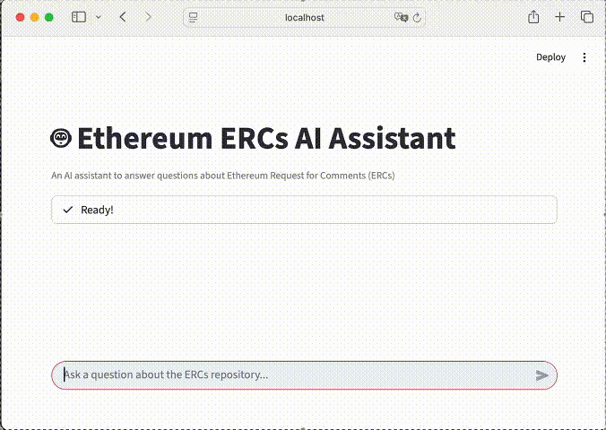
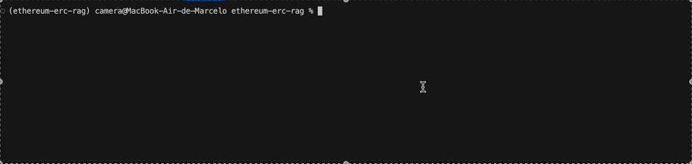
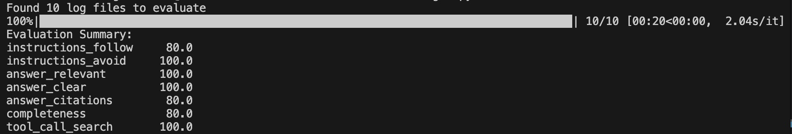

# Ethereum Request for Comments (ERCs) AI Agent

[](https://github.com/mcamera/ethereum-erc-rag/stargazers)
[](https://github.com/mcamera/ethereum-erc-rag/blob/main/LICENSE)
[](https://www.python.org/downloads/)
[](https://ethereum-ercs.streamlit.app/)



## Project Overview

This project implements a comprehensive Retrieval-Augmented Generation (RAG) system for Ethereum Request for Comments (ERC) documents. It downloads and processes ERC markdown files from the [Ethereum ERC GitHub repository](https://github.com/ethereum/ERCs), creating an intelligent AI assistant that can answer questions about Ethereum improvement proposals through natural language interaction.

**🚀 Live Demo**: [https://ethereum-ercs.streamlit.app/](https://ethereum-ercs.streamlit.app/)

## Key Features

- 🌐 **Live Web Interface**: Interactive Streamlit application deployed and accessible online
- 🔄 **Automated Repository Scraping**: Downloads and extracts markdown files from the Ethereum GitHub repository
- 📄 **Frontmatter Processing**: Parses YAML frontmatter from markdown files for structured metadata
- 🧠 **Intelligent Document Processing**: Multiple chunking strategies including sliding window, section-based splitting, and AI-powered intelligent chunking
- 🔍 **Hybrid Search Engine**: Combines lexical search (MinSearch) with vector search (sentence transformers) for optimal retrieval
- 🤖 **Pydantic AI Agent**: Implements an intelligent agent with tool calling capabilities for ERC Q&A
- 📊 **Comprehensive Evaluation**: LLM-as-a-judge evaluation system with structured assessment criteria
- � **Conversational Interface**: Natural language Q&A with automatic source citations and GitHub links

## Requirements

- python 3.13+
- Dependencies managed with `uv` package manager
- Google AI API key (for Gemini models)

## Installation & Setup

1. **Clone the repository**:
   ```bash
   git clone https://github.com/mcamera/ethereum-erc-rag.git
   cd ethereum-erc-rag
   ```

2. **Install dependencies** (using uv):
   ```bash
   uv sync --dev
   ```

3. **Set up environment variables**:
   ```bash
   cp .env.example .env
   # Edit .env and add your GOOGLE_API_KEY
   ```

## Usage

### Using the Command Line Interface

For direct interaction through the terminal:

1. **Run the interactive CLI**:
   ```bash
   python3 -m src.main
   ```



2. **How it works**:
   - The system will automatically download and index the Ethereum ERCs repository
   - Once initialized, you can ask questions in natural language
   - Type your questions and press Enter to get responses
   - Type 'stop' to exit the program

3. **Example interaction**:
   ```
   Your question: What is ERC-20?
   Response: [AI response with citations]
   
   Your question: How does ERC-721 differ from ERC-20?
   Response: [AI response comparing the standards]
   
   Your question: stop
   Goodbye!
   ```

### Using the Streamlit Web Interface

For the best user experience, use the interactive web application:

1. **Try the live app**: [https://ethereum-ercs.streamlit.app/](https://ethereum-ercs.streamlit.app/)

2. **Or run locally**:
   ```bash
   uv run streamlit run app.py
   ```
   Then access at `http://localhost:8501`

3. **Features available**:
   - Ask questions about Ethereum ERCs in natural language
   - Get AI-powered responses with automatic source citations
   - View conversation history in an intuitive chat interface
   - Experience cached loading for optimal performance

### Using the Interactive Notebook

For detailed exploration and development:

1. **Start Jupyter**:
   ```bash
   uv run jupyter notebook
   ```

2. **Open** `docs/ai_agent_notebook.ipynb` and explore:
   - Document ingestion and processing pipeline
   - Comparison of chunking strategies (sliding window vs. section-based vs. AI-powered)
   - Search implementation (lexical, vector, hybrid)
   - Agent development with Pydantic AI
   - Comprehensive evaluation and testing framework

## Running Evaluations

The project includes a comprehensive evaluation framework to assess the AI agent's performance:

### Generate Test Data

1. **Create evaluation questions and answers**:
   ```bash
   python3 -m eval.data_generation
   ```

2. **What it does**:
   - Samples 10 random documents from the indexed ERCs
   - Generates realistic questions using AI
   - Gets answers from the agent for each question
   - Logs all interactions to `eval_logs/` directory

### Run Evaluation Analysis

1. **Evaluate logged interactions**:
   ```bash
   python3 -m eval.evaluations
   ```

2. **What it analyzes**:
   - Instructions adherence and avoidance patterns
   - Answer relevance, clarity, and completeness
   - Citation accuracy and tool usage verification
   - Generates quantitative performance metrics

## Architecture

### Document Processing Pipeline
- **Data Ingestion**: `read_repo_data()` downloads and processes GitHub repository content
- **Chunking Strategies**:
  - **Sliding Window**: `sliding_window()` with configurable size (2000) and step (1000)
  - **Section-Based**: `split_markdown_by_level()` splits by markdown headers
  - **AI-Powered**: `intelligent_chunking()` uses Gemini for semantic chunking

### Search Implementation
- **Lexical Search**: MinSearch index with TF-IDF scoring on multiple text fields
- **Vector Search**: Sentence transformers (`multi-qa-distilbert-cos-v1`) with semantic similarity
- **Hybrid Search**: Combines both approaches with deduplication for optimal results

### Conversational AI Agent
- **Framework**: Pydantic AI with Google Gemini 2.5 Flash models
- **Tools**: `text_search()` function integrated as agent tool for document retrieval
- **Capabilities**: Intelligent question answering with automatic source citations
- **References**: Automatic GitHub link generation for source materials

### Evaluation Framework
- **Structured Logging**: Comprehensive interaction logging with JSON serialization
- **LLM-as-Judge**: Automated evaluation using structured criteria:
  - Instructions adherence and avoidance patterns
  - Answer relevance, clarity, and completeness
  - Citation accuracy and tool usage verification
- **Test Generation**: AI-powered question generation from real ERC content
- **Quantitative Analysis**: Pandas-based statistical evaluation of agent performance

## Development

This project uses modern Python development practices:
- **UV** for fast dependency management
- **Black** for code formatting
- **isort** for import sorting  
- **Jupyter** for interactive development and experimentation
- **Pydantic** for type safety and validation

Run development tools:
```bash
# Format code
black .

# Sort imports
isort .

# Sync dependencies
uv sync --dev
```

## Development Roadmap

### ✅ Day 1: Ingest and Index the Data (Complete)
- [x] Fetch GitHub repository content
- [x] Extract and parse markdown documentation
- [x] Prepare data for search

### ✅ Day 2: Intelligent Processing for Data (Complete)
- [x] Cut and chunk the data for better search
- [x] Split big documents using paragraphs and sections
- [x] Apply intelligent chunking with AI

### ✅ Day 3: Add Search (Complete)
- [x] Lexical search with MinSearch for keyword matching
- [x] Semantic search with sentence transformers
- [x] Hybrid search combining both approaches with result deduplication

### ✅ Day 4: Agentic Search (Complete)
- [x] Implement RAG with Pydantic AI Agent
- [x] Define search tools for the agent
- [x] Create intelligent ERC documentation assistant with citation support
- [x] Build conversational interface with structured responses

### ✅ Day 5: Offline Evaluation and Testing (Complete)
- [x] Comprehensive logging system
- [x] LLM-as-a-judge evaluation
- [x] Automated question generation for systematic testing
- [x] Multi-criteria evaluation framework with quantitative metrics
- [x] Pandas-based analysis of agent performance across test cases

### ✅ Day 6: Deploy the Agent (Complete)
- [x] Create Streamlit UI for public access
- [x] Implement interactive web interface with conversation history
- [x] Add cached agent initialization and async event loop handling
- [x] Deploy to cloud platform for live usage

## Evaluation Results

The system demonstrates strong performance across evaluation criteria:
- **Instructions Follow**: High adherence to system prompts and user requirements
- **Answer Relevance**: Consistently addresses user questions directly
- **Answer Clarity**: Provides clear, technically accurate responses
- **Citation Quality**: Automatically includes proper source references with GitHub links
- **Completeness**: Comprehensive coverage of technical topics
- **Tool Usage**: Effective search tool invocation for information retrieval

**Results:**




**Evaluation Summary**
The agent achieved excellent performance with an average score of 91.4% across all metrics. Perfect scores (100%) were attained in instructions adherence, answer relevance, answer clarity, and search tool usage, demonstrating the system's reliability and accuracy.

Areas with 80% scores (instructions follow, citations, and completeness) indicate strong performance with room for minor improvements. These results validate the effectiveness of the RAG architecture and hybrid search approach for Ethereum documentation assistance.

## Technical Stack

- **Python 3.13** with modern async/await patterns
- **Pydantic AI** for agent framework and structured outputs
- **Google Gemini 2.5** for LLM capabilities  
- **Sentence Transformers** for semantic embeddings
- **MinSearch** for efficient text and vector search
- **Jupyter** for interactive development
- **UV** for dependency management

## More info

This project follows the AI Agents Course from Alexey Grigorev. Want to follow along?

👉 Sign up here: https://alexeygrigorev.com/aihero/

## License

See LICENSE file for details.
